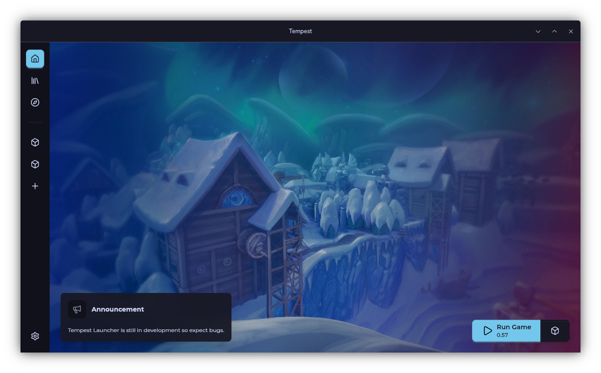

# Tempest

Tempest is a community-made launcher for paladins.
Capable of:

- Downloading and playing any patch of paladins released from 2016 to 2026
- Playing with mods
- Hosting and Joining private servers

How to Download

> Navigate to the Latest Release
> Click on the installer corresponding to your Operating System
> Run the installer

Windows: .MSI
Linux: .APPIMAGE
MacOS: .DMG

Learn more about Tempest and Paladins on our [wiki](https://docs.lowrezstudio.com/).

## Launcher

## Contributing

If you want to contribute to the project, start by reading the [contributing guide](.github/CONTRIBUTING.md). If you have any questions, feel free to ask in our [Discord server](https://discord.gg/2FyZDuxAk4d9).
